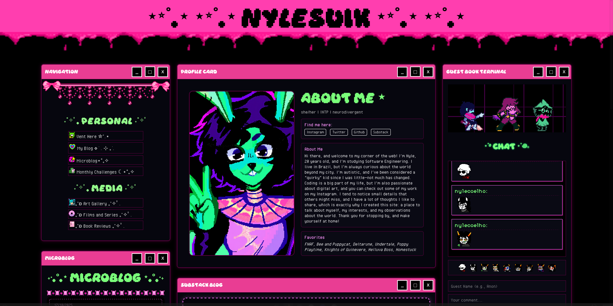

# Neocities Blog — Old Version

This repository contains an old version of my personal blog originally created for Neocities.

⚠️ **Important note before anything else**  

This is **not a complete or fully functional website**. Some planned features were never developed, and in this version **none of the secondary pages were implemented**. What exists here is mainly the structure and the visual concept of the homepage.

## About the Project

The focus of this project is **visual identity**, not functionality.

The HTML, CSS, and JavaScript included here are incomplete on purpose. The goal was to experiment with layout, aesthetics, and atmosphere rather than building a production-ready website. Think of this as a visual prototype or a design playground rather than a finished product.

As with many Neocities projects, I deliberately leaned into **early 2000s web aesthetics** — personal, imperfect, expressive, and slightly chaotic. This includes decorative elements, playful layouts, and a stronger sense of personality over modern UX conventions.

(￣▽￣)ノ

## Assets & Credits

Most visual assets (images, gifs, icons, etc.) are **hidden or not included in this repository**.

The reason is simple:  
many of them are **not my original work**, and I do not feel comfortable redistributing third-party assets as if they were mine. Only a few assets were created by me.

If you plan to reuse this template, you will need to **replace the assets with your own** or properly source them.

## Usage

You are free to:
- Use this project as a **template**
- Use it as **inspiration**
- Modify it for your own Neocities or personal website

Please note:
- The code is incomplete
- You will need to finish or adapt functionality on your own
- This project prioritizes aesthetics over structure or scalability

If you decide to use or adapt this work, **please provide proper credit whenever possible**. It’s appreciated and helps respect the original intent of the project. (´･ω･`)

## Final Notes

This project exists as a snapshot of a moment — a version of my creative process that no longer fully represents who I am today, but still matters as a reference and learning experience.

Use it freely, but use it consciously.  
That’s all.

(._.)
